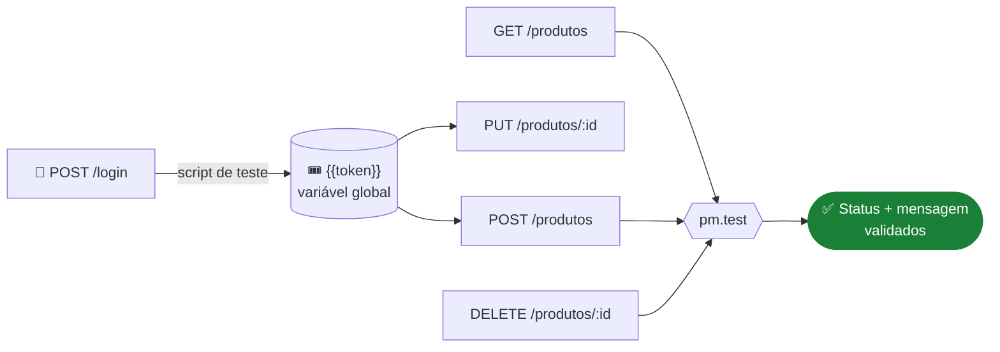
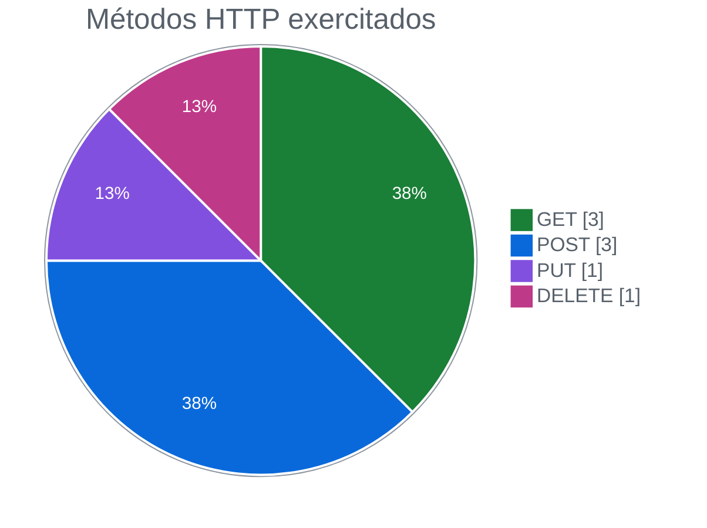
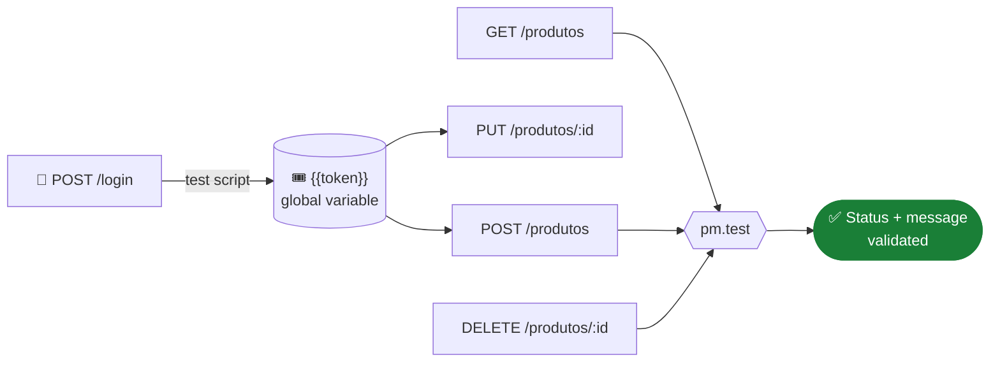
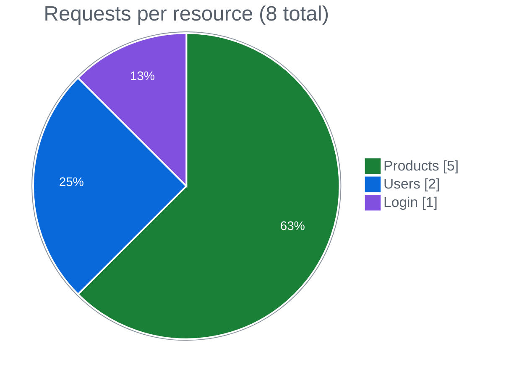

<div align="center">

# 📮 ServeRest · Testes de API com Postman

**Montei uma collection no Postman para testar produtos, usuários e login da API ServeRest, com asserções automáticas e token capturado por script**


🇧🇷 [Português](#-português) · 🇺🇸 [English](#-english)

</div>

---

## 🇧🇷 Português

### 🎯 Objetivo

Antes de automatizar testes de API em código, quis dominar a ferramenta que todo time de QA usa no dia a dia para explorar e validar endpoints: o **Postman**.

Usei a **ServeRest**, uma API REST que simula uma loja virtual, e organizei uma collection para validar:

- o **CRUD de produtos** (listar, consultar, cadastrar, editar e excluir),
- o **cadastro e a consulta de usuários**,
- e o **login**, com o token de autenticação reaproveitado nas rotas protegidas.

### 🧭 Estratégia

Organizei a collection por recurso da API e automatizei a parte que mais atrasa um teste manual de API: copiar e colar o token de autenticação.



**Token automático.** No retorno do login, um script lê o campo `authorization` e salva em uma variável global. Todas as requisições protegidas usam essa variável, e o fluxo inteiro roda sem nenhuma intervenção manual.

```javascript
const resposta = pm.response.json();
pm.globals.set("token", resposta.authorization);
```

**Asserções em cada operação crítica.** Nas requisições de listar, cadastrar e excluir produto, escrevi testes que conferem o **status HTTP** e a **mensagem de negócio** devolvida pela API.

### 🧪 Cobertura


| Recurso | Requisição | Método | Validação automática |
|---|---|:-:|---|
| 📦 Produtos | Listar produtos | `GET` | ✅ Status 200 + produto esperado na lista |
| 📦 Produtos | Cadastrar produto | `POST` | ✅ Status 201 + `Cadastro realizado com sucesso` |
| 📦 Produtos | Consultar por ID | `GET` | Exploratória |
| 📦 Produtos | Editar produto | `PUT` | Exploratória |
| 📦 Produtos | Excluir produto | `DELETE` | ✅ Status 200 + `Registro excluído com sucesso` |
| 👤 Usuários | Criar usuário | `POST` | Exploratória |
| 👤 Usuários | Buscar por ID | `GET` | Exploratória |
| 🔐 Login | Autenticar | `POST` | ⚙️ Salva o token em variável global |



### 📈 Resultados

- **Cobri o CRUD completo de produtos**, com os quatro métodos HTTP.
- **Automatizei 6 asserções** de status e de mensagem de negócio nas operações de listar, cadastrar e excluir.
- **Eliminei o passo manual do token:** o login alimenta sozinho as requisições protegidas.
- **Entreguei uma collection versionada:** o arquivo `.json` está no repositório e qualquer pessoa do time pode importar e rodar.

### 🚀 Onde esse trabalho se aplica

- **Exploração de API nova:** a collection é o primeiro passo para entender uma API antes de automatizar em código.
- **Execução em lote:** pelo Collection Runner ou pelo Newman, a mesma collection roda inteira de uma vez, inclusive em pipeline de CI.
- **Documentação viva:** as requisições organizadas por recurso servem de referência de uso da API para o time.
- **Evolução para código:** levei esses mesmos endpoints para testes automatizados com Cypress e Jenkins no projeto [teste-api-serverest-cypress-jenkins](https://github.com/gustavoanderson/teste-api-serverest-cypress-jenkins).

### ▶️ Como executar

1. Suba a ServeRest localmente: `npx serverest@latest`
2. No Postman, clique em **Import** e selecione o arquivo `Teste Serverest.postman_collection.json`
3. Rode a requisição **login** primeiro, para gerar o token
4. Execute as demais requisições, ou a collection inteira pelo **Collection Runner**

Pela linha de comando, com Newman:

```bash
npx newman run "Teste Serverest.postman_collection.json"
```

---

## 🇺🇸 English

### 🎯 Goal

Before automating API tests in code, I wanted to master the tool every QA team uses daily to explore and validate endpoints: **Postman**.

I used **ServeRest**, a REST API that simulates an online store, and built a collection to validate the **products CRUD**, **user sign-up and lookup**, and **login**, with the auth token reused on protected routes.

### 🧭 Strategy



**Automatic token.** On the login response, a script reads the `authorization` field and saves it as a global variable, so every protected request runs without manual copy-paste.

**Assertions on critical operations.** On list, create and delete product, I wrote tests that check both the **HTTP status** and the **business message** returned by the API.

### 🧪 Coverage



### 📈 Results

- **I covered the full products CRUD**, with all four HTTP methods.
- **I automated 6 assertions** on status and business messages.
- **I removed the manual token step:** login feeds protected requests automatically.
- **I delivered a versioned collection** that anyone on the team can import and run.

### 🚀 Where this applies

- **Exploring a new API** before automating it in code.
- **Batch runs** through Collection Runner or Newman, including in CI pipelines.
- **Living documentation** of how the API is used.
- **Moving to code:** I took these endpoints into Cypress + Jenkins in [teste-api-serverest-cypress-jenkins](https://github.com/gustavoanderson/teste-api-serverest-cypress-jenkins).

### ▶️ How to run

1. Start ServeRest locally: `npx serverest@latest`
2. In Postman, **Import** `Teste Serverest.postman_collection.json`
3. Run **login** first to generate the token
4. Run the other requests, or the whole collection with **Collection Runner**

---

<div align="center">

Feito por **Gustavo Anderson** · QA Engineer
[](https://www.linkedin.com/in/gustavo-anderson)
[](https://github.com/gustavoanderson)

</div>
